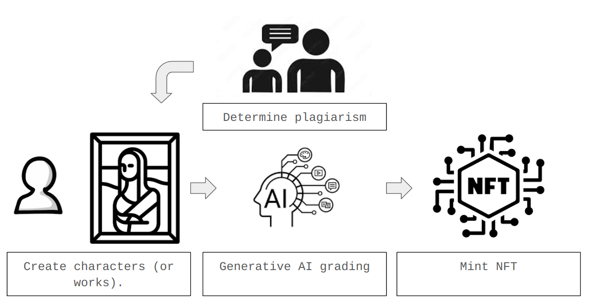

# CNMB: Creative NFT Marketplace Builder



CNMB is a decentralized application (dApp) that allows users to create their own characters, which are graded by AI and minted as NFTs. These characters have the potential to integrate with gaming in the future, while also being appreciated as unique works of art today. We’ve selected Gemini as the grading model and use our native token for bidding and trading these NFTs. By leveraging Chainlink, we connect on-chain and off-chain data to ensure seamless functionality. We believe this innovative platform has the potential to make a significant impact in today's digital landscape.

### Install package

**About Foundry**
```shell
$ forge install OpenZeppelin/openzeppelin-contracts
$ forge install smartcontractkit/foundry-chainlink-toolkit
```

**About npm**
```shell
$ cd webpage
$ npm install
```

### Deploy smart contract

```
$ forge create --rpc-url $FUJI_RPC_URL --private-key $PRIVATE_KEY src/CharacterNFT.sol:CharacterNFT
```
You should first export `FUJI_RPC_URL` and `PRIVATE_KEY`. 
After deploying the contract, you need to add your contract address to `webpage/public/src/js/contract.json`.

### Run webpage

- first time
```shell
npm ci
```

```shell
$ cd next_web
$ npm run dev
```
